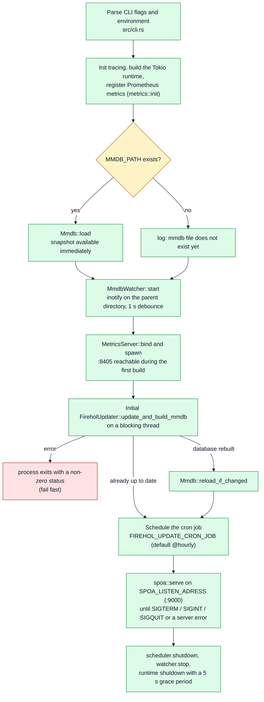
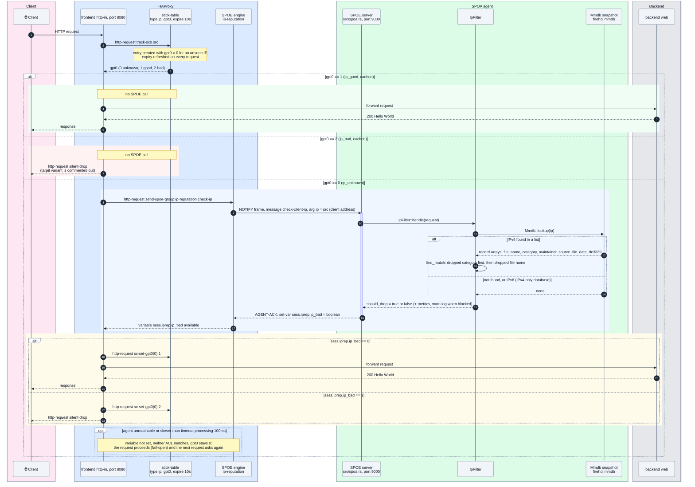
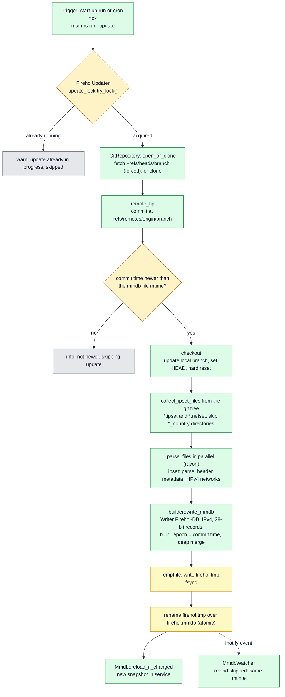
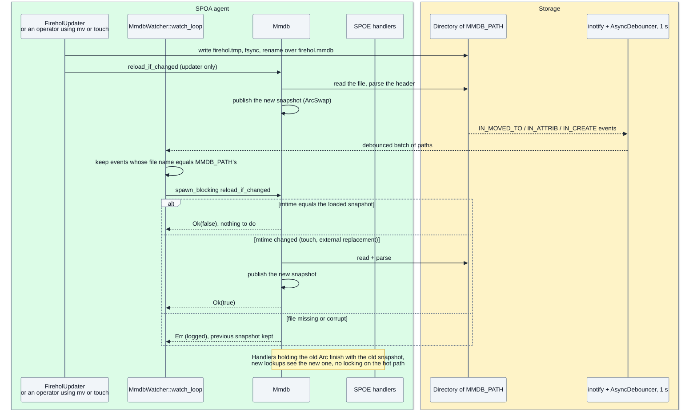
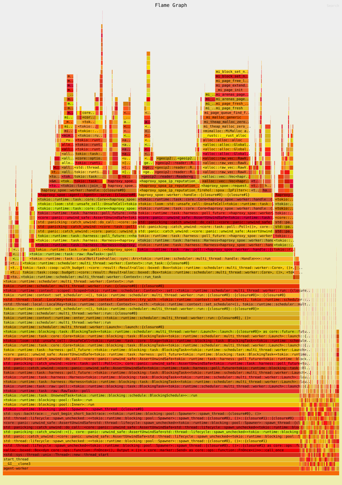
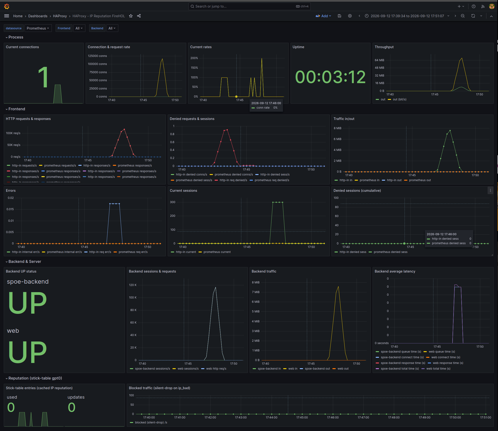

# HAProxy SPOA IP Reputation (FireHOL)

A Stream Processing Offload Agent (SPOA) for HAProxy, written in Rust, that tells HAProxy whether a
client IP address appears in the [FireHOL blocklists](https://github.com/firehol/blocklist-ipsets).
HAProxy asks the agent once per unknown IP through the Stream Processing Offload Engine (SPOE),
caches the verdict in a stick table for a few seconds, and silently drops requests coming from
blocked addresses before they ever reach a backend.

The agent keeps its own copy of the FireHOL git repository, compiles the selected lists into a
MaxMind DB (`.mmdb`) file, hot-reloads that file without interrupting traffic, refreshes it on a
cron schedule, and exposes Prometheus metrics. The whole stack (HAProxy, agent, Prometheus,
Grafana) can be started with Docker Compose.

## Table of Contents

- [✨ Features](#features)
- [🏗️ Architecture](#architecture)
- [⚙️ How It Works](#how-it-works)
- [🔄 Request Flow](#request-flow)
- [🗃️ HaProxy Stick Table Caching](#haproxy-stick-table-caching)
- [🔌 HAProxy & SPOE Integration](#haproxy--spoe-integration)
- [♻️ FireHOL Database Lifecycle](#firehol-database-lifecycle)
  - [📥 Update pipeline](#update-pipeline-srcfirehol)
  - [⏰ Scheduling](#scheduling)
  - [🔥 Hot reload](#hot-reload)
- [📁 Source Code Structure](#source-code-structure)
  - [🧩 Modules](#modules)
- [🛠️ Configuration](#configuration)
- [📊 Metrics & Monitoring](#metrics--monitoring)
  - [📍 Agent metrics](#agent-metrics-get-http-host-8405-any-path)
- [⚒️ Build](#build)
  - [⚙️ Prerequisites](#prerequisites)
  - [📦 Vendored `geoip2` crate](#vendored-geoip2-crate)
  - [💻 Commands](#commands)
- [🚀 Running](#running)
  - [🖥️ Locally](#locally)
  - [🐳 Docker Compose stack](#docker-compose-stack)
- [🧪 Testing](#testing)
  - [✅ Unit tests](#unit-tests)
  - [📊 Benchmarks as tests](#benchmarks-as-tests)
  - [🛡️ Quality gates](#quality-gates)
- [🏁 Benchmark](#benchmark)
  - [📏 What is measured](#what-is-measured)
  - [🔬 How it works](#how-it-works)
  - [🎯 Which part of the agent is exercised](#which-part-of-the-agent-is-exercised)
  - [🔗 Relation to the SPOA request flow](#relation-to-the-spoa-request-flow)
  - [▶️ Running it](#running-it)
  - [🔧 Requirements](#requirements)
  - [📈 Results and artefacts](#results-and-artefacts)
  - [🖥️ Example output](#example-output)
  - [🔥 Flamegraph](#flamegraph)
  - [🐳 Docker benchmark](#docker-benchmark-make-bench-docker)
- [⚡ Performance Notes](#performance-notes)
- [📜 License](#license)

## Features

- 🛡️ **Real-time IP Blocking**: Blocks malicious IPs at HAProxy level before reaching backend
- 🌎 **FireHol Integration**: Auto-updates from [FireHol blocklist-ipsets](https://github.com/firehol/blocklist-ipsets)
- 🗃️ **Category-based Filtering**: Block IPs by category (abuse, spam, attacks, etc.)
- 📃 **File Name-based Filtering**: Block IPs by file name (cybercrime.ipset, cidr_report_bogons.netset, etc.)
- 🔥 **Hot Reload**: MMDB updates without service interruption
- 🚀 **High Performance**: Rust-based SPOA with parallel processing
- ♻️ **Cron Auto-Update**: Configurable update schedule (default: hourly)

## Architecture

```mermaid
%%{init: {"theme": "base", "themeVariables": {"fontFamily": "Inter, Segoe UI, Helvetica, Arial, sans-serif", "background": "#FFFFFF", "mainBkg": "#F8FAFC", "primaryColor": "#F8FAFC", "primaryTextColor": "#111827", "primaryBorderColor": "#64748B", "secondaryColor": "#F1F5F9", "secondaryTextColor": "#111827", "secondaryBorderColor": "#64748B", "tertiaryColor": "#F1F5F9", "tertiaryTextColor": "#111827", "tertiaryBorderColor": "#94A3B8", "textColor": "#111827", "nodeTextColor": "#111827", "labelColor": "#111827", "titleColor": "#111827", "lineColor": "#1F2937", "edgeLabelBackground": "#FFFFFF", "clusterBkg": "#F8FAFC", "clusterBorder": "#94A3B8", "actorBkg": "#F1F5F9", "actorBorder": "#64748B", "actorTextColor": "#111827", "actorLineColor": "#64748B", "signalColor": "#1F2937", "signalTextColor": "#111827", "labelBoxBkgColor": "#F8FAFC", "labelBoxBorderColor": "#64748B", "labelTextColor": "#111827", "loopTextColor": "#111827", "noteBkgColor": "#FEF9C3", "noteBorderColor": "#CA8A04", "noteTextColor": "#111827", "activationBkgColor": "#E0E7FF", "activationBorderColor": "#4F46E5", "sequenceNumberColor": "#FFFFFF", "stateBkg": "#F8FAFC", "stateBorder": "#64748B", "stateLabelColor": "#111827", "transitionColor": "#1F2937", "transitionLabelColor": "#111827", "specialStateColor": "#1F2937"}}}%%
flowchart LR
    client["🌐 Client<br/>browser, bot, scanner"]
    github["GitHub<br/>firehol/blocklist-ipsets"]

    subgraph compose["Docker Compose network: proxy"]
        direction LR

        subgraph haproxy["HAProxy 3.4 (haproxy/haproxy.cfg)"]
            direction TB
            fe["frontend http-in<br/>:8080"]
            st[("stick-table<br/>type ip, size 1m, expire 10s<br/>store gpt0")]
            spoe["SPOE filter, engine ip-reputation<br/>(haproxy-spoa-ip-reputation-firehol.cfg)"]
            spoeb["backend spoe-backend<br/>mode tcp, option spop-check"]
            web["backend web<br/>returns 200 Hello World"]
            stats["stats page + prometheus-exporter<br/>:8404"]
        end

        subgraph spoa["SPOA agent (this repository, Rust)"]
            direction TB
            srv["SPOE server<br/>src/spoa.rs, :9000"]
            filt["IpFilter<br/>drop by category / file name"]
            mmdb["Mmdb snapshot<br/>src/mmdb.rs (arc-swap, zero-copy lookups)"]
            upd["FireholUpdater<br/>src/firehol/, cron @hourly"]
            watch["MmdbWatcher<br/>src/mmdb_watcher.rs (inotify)"]
            met["Metrics endpoint<br/>src/metrics_server.rs, :8405"]
        end

        subgraph storage["Storage (container file system)"]
            direction TB
            file[("firehol.mmdb<br/>MaxMind DB, IPv4 search tree")]
            repo[("firehol-blocklist-ipsets/<br/>git clone")]
        end

        subgraph monitoring["Monitoring"]
            direction TB
            prom["Prometheus 3.14<br/>:9090"]
            graf["Grafana 10.1<br/>:3000"]
        end
    end

    client -->|"HTTP request"| fe
    fe -->|"track-sc0 src, read gpt0"| st
    fe -->|"send-spoe-group check-ip<br/>only when gpt0 == 0"| spoe
    spoe -->|"NOTIFY check-client-ip(ip)"| spoeb
    spoeb <-->|"SPOP 2.0 over TCP"| srv
    srv -->|"handle(request)"| filt
    filt -->|"lookup(ip)"| mmdb
    fe -->|"sc-set-gpt0(0) 1 or 2"| st
    fe -->|"allowed"| web
    fe -.->|"ip_bad: silent-drop"| client
    upd -->|"fetch / clone"| github
    upd -->|"hard reset, read lists"| repo
    upd -->|"write .tmp, fsync, rename"| file
    upd -->|"reload after rebuild"| mmdb
    watch -->|"watch parent directory"| file
    watch -->|"reload_if_changed"| mmdb
    prom -->|"scrape /metrics every 5 s"| met
    prom -->|"scrape /metrics every 5 s"| stats
    graf -->|"PromQL"| prom

    classDef clientNode fill:#FCE7F3,stroke:#DB2777,color:#111827,stroke-width:2px
    classDef haproxyNode fill:#DBEAFE,stroke:#1D4ED8,color:#111827,stroke-width:2px
    classDef spoaNode fill:#DCFCE7,stroke:#15803D,color:#111827,stroke-width:2px
    classDef storageNode fill:#FEF3C7,stroke:#B45309,color:#111827,stroke-width:2px
    classDef backendNode fill:#E5E7EB,stroke:#4B5563,color:#111827,stroke-width:2px
    classDef monitorNode fill:#EDE9FE,stroke:#6D28D9,color:#111827,stroke-width:2px
    classDef externalNode fill:#CCFBF1,stroke:#0F766E,color:#111827,stroke-width:2px
    class client clientNode
    class fe,st,spoe,spoeb,stats haproxyNode
    class web backendNode
    class srv,filt,mmdb,upd,watch,met spoaNode
    class file,repo storageNode
    class prom,graf monitorNode
    class github externalNode
    style haproxy fill:#EFF6FF,stroke:#93C5FD
    style spoa fill:#F0FDF4,stroke:#86EFAC
    style storage fill:#FFFBEB,stroke:#FCD34D
    style monitoring fill:#F5F3FF,stroke:#C4B5FD
```



Components and where they live:

| Component           | Location                                                            | Role                                                                                                                                                                                                |
|---------------------|---------------------------------------------------------------------|-----------------------------------------------------------------------------------------------------------------------------------------------------------------------------------------------------|
| HAProxy             | `haproxy/haproxy.cfg`, image `haproxy:3.4-alpine`                   | Terminates client HTTP on `:8080`, tracks client IPs in a stick table, queries the agent for unknown IPs, drops bad ones, serves `backend web`. Exposes stats and a Prometheus exporter on `:8404`. |
| SPOE engine         | `haproxy/haproxy-spoa-ip-reputation-firehol.cfg`                    | Declares the agent `ip-reputation`, the group `check-ip` and the message `check-client-ip` (argument `ip`).                                                                                         |
| SPOA agent          | `src/` (this crate)                                                 | Answers `check-client-ip` with the boolean variable `ip_bad`; maintains the database; serves metrics.                                                                                               |
| IP reputation logic | `src/spoa.rs` (`IpFilter`), `src/mmdb.rs` (`Mmdb`)                  | Looks the IP up in the in-memory MMDB snapshot and applies the category / file-name drop rules.                                                                                                     |
| FireHOL database    | `firehol.mmdb` (generated), `firehol-blocklist-ipsets/` (git clone) | IPv4 MaxMind DB built from the selected `.ipset`/`.netset` files.                                                                                                                                   |
| Backend             | `backend web` in `haproxy.cfg`                                      | Demo backend returning `200 Hello World`; replace with real servers.                                                                                                                                |
| Monitoring          | `prometheus/prometheus.yml`, `grafana/`                             | Prometheus scrapes HAProxy (`haproxy:8404`) and the agent (`spoa:8405`); Grafana is provisioned with a Prometheus datasource and an HAProxy dashboard.                                              |


## How It Works

The agent is a single binary. Its start-up sequence is implemented by `run()` in `src/main.rs`:



Key points of the design:

- **HAProxy decides, the agent advises.** The agent only sets `ip_bad`; every enforcement action
  (`silent-drop`, the commented-out `tarpit`) and the caching policy live in `haproxy.cfg`.
- **The database is a snapshot in memory.** `Mmdb` (`src/mmdb.rs`) reads the whole `.mmdb` file
  into a `Box<[u8]>` and keeps the `geoip2` reader next to it in a self-referential cell
  (`self_cell`). The current snapshot is published through an `ArcSwapOption`, so lookups are
  lock-free and a reload never blocks or interrupts in-flight requests.
- **Lookups are zero-copy.** `Mmdb::lookup` hands the decoded record (borrowed `&str` slices) to a
  closure; nothing is copied on the hot path.
- **The SPOE listener opens only once a database exists.** Metrics are served before that, so the
  first (long) build is observable.
- **Updates are atomic and idempotent.** The new file is written to `<MMDB_PATH with .tmp
  extension>`, fsynced, then renamed over the old one; a rebuild is skipped when the newest FireHOL
  commit is not newer than the file's modification time; overlapping runs are prevented by a lock.

## Request Flow




## HaProxy Stick Table Caching

The stick table is the cache that keeps SPOE traffic low:

```haproxy
stick-table type ip size 1m expire 10s store gpt0
http-request track-sc0 src
acl ip_good    sc_get_gpt0(0) -m int eq 1
acl ip_bad     sc_get_gpt0(0) -m int eq 2
acl ip_unknown sc_get_gpt0(0) -m int eq 0
```

| Element      | Meaning                                                                                                                                                                    |
|--------------|----------------------------------------------------------------------------------------------------------------------------------------------------------------------------|
| `type ip`    | Keyed by client IP (`src`, IPv4 or IPv6).                                                                                                                                  |
| `size 1m`    | Up to 1,048,576 entries; when the table is full HAProxy purges a few of the oldest entries to make room.                                                                   |
| `expire 10s` | An entry disappears 10 s after it was last touched. Every request refreshes it (`track-sc0`), so an active client keeps its verdict; a quiet one is re-checked after 10 s. |
| `store gpt0` | The only stored datum: `0` unknown (default), `1` good, `2` bad.                                                                                                           |

Consequences worth knowing:

- **Cache hits never reach the agent.** With gpt0 at `1` or `2` the `send-spoe-group` rule is
  skipped entirely; the agent is only consulted for the first request of an IP (per 10 s window).
- **Fail-open.** If the agent is down or misses `timeout processing 100ms`, the variable stays
  unset, gpt0 stays `0` and the request is served; nothing is cached, so the next request retries.
- **The cache is local to one HAProxy process.** No `peers` section is configured; each HAProxy
  instance keeps its own table.
- **Key versus checked address.** The table is keyed by the client address (`src`), which is also
  the address the shipped SPOE message checks (`args ip=src`). If you switch the message to
  `urlp(ip)` for manual tests (see [Docker Compose stack](#docker-compose-stack)), one request with
  a listed `?ip=` marks *your own* source address as bad for 10 s.
- **Tuning.** Raise `expire` to query the agent less often, lower it to pick up new blocklist data
  faster. The agent itself has no per-IP cache; its lookups are a few hundred nanoseconds.

## HAProxy & SPOE Integration

`haproxy/haproxy-spoa-ip-reputation-firehol.cfg` declares the SPOE engine that `haproxy.cfg`
attaches with `filter spoe engine ip-reputation config /etc/haproxy/haproxy-spoa-ip-reputation-firehol.cfg`:

```haproxy
[ip-reputation]
spoe-agent ip-reputation
    groups check-ip
    option var-prefix iprep
    option pipelining
    timeout hello 2s
    timeout idle 30s
    timeout processing 100ms
    use-backend spoe-backend

spoe-message check-client-ip
    args ip=src

spoe-group check-ip
    messages check-client-ip
```

The agent backend and health check:

```haproxy
backend spoe-backend
    mode tcp
    option spop-check
    server spoa1 spoa:9000 check
```

## FireHOL Database Lifecycle

### Update pipeline (`src/firehol/`)



Details of each stage:

- **Git synchronisation (`git.rs`).** `open_or_clone` opens `FIREHOL_REPO_PATH` and fetches
  `FIREHOL_REPO_BRANCH` with a forced refspec (`+refs/heads/<branch>:refs/remotes/origin/<branch>`),
  or clones `FIREHOL_REPO_URL` when the directory is missing or empty (for example a freshly
  mounted volume). The forced refspec and the hard reset are required because FireHOL rewrites the
  branch history on every publication. TLS certificate validation is intentionally disabled for
  these fetches (`CertificateCheckStatus::CertificateOk`): the static musl build embeds OpenSSL
  without a CA bundle location.
- **Freshness check.** The commit time of the remote tip is compared with the modification time of
  the MMDB file (`0` when it does not exist). Nothing is rebuilt when the file is already newer.
- **File selection (`mod.rs`).** The git tree of the commit is walked; blobs ending in `.ipset` or
  `.netset` are kept. Directories ending in `_country` (`dbip_country`, `geolite2_country`,
  `ip2location_country`, `ipdeny_country`, `ipip_country`) are skipped unless
  `FIREHOL_IGNORE_COUNTRY=false`.
- **Parsing (`ipset.rs`).** Files are read from the working tree in parallel. Header comments of
  the form `# Key : value` feed the record metadata (`Category`, `Maintainer`, `Maintainer URL`,
  `List source URL`, `Source File Date`, the latter converted from `Thu Sep 10 23:59:49 UTC 2026`
  to RFC 3339). Every other non-empty line must be an IPv4 address (`/32`) or CIDR. A file with a
  malformed line, an IPv6 entry or an unparsable date is skipped with a warning; the rest of the
  build continues. A build with zero networks fails.
- **Writing (`builder.rs`).** `write_mmdb` inserts each network with deep-merge semantics, serialises
  the tree, writes `<MMDB_PATH>.tmp` (same directory), fsyncs it and renames it over the target.
  `TempFile` removes the temporary file if anything fails in between.
- **Loading.** `run_update` in `main.rs` calls `Mmdb::reload_if_changed` right after a successful
  build, so the SPOE handlers switch to the new data without waiting for the file watcher.

### Scheduling

`tokio-cron-scheduler` runs the pipeline according to `FIREHOL_UPDATE_CRON_JOB` (default
`@hourly`; standard cron expressions such as `0 */6 * * *` are also accepted). The first run happens
synchronously at start-up. Failures of scheduled runs are logged at `error` level and the previous
database stays in service; a failure of the start-up run terminates the process.

### Hot reload



The watcher observes the **parent directory** of `MMDB_PATH` (non-recursive) rather than the file
itself, because a rename replaces the inode and would kill a watch placed on the old file. Events
are debounced for one second, filtered by file name, and every candidate triggers
`Mmdb::reload_if_changed` on a blocking thread. Touching the file (`touch firehol.mmdb`, or
`make docker-touch-mmdb` in Compose) forces a reload because the modification time changes.

## Source Code Structure

```
.
├── Cargo.toml, Cargo.lock       Rust crate (edition 2024); Cargo.lock is git-ignored
├── build.rs                     Embeds BUILD_VERSION (GIT_VERSION env, else git tag, else short commit, else crate version)
├── Makefile                     build / test / lint / bench / flamegraph / docker targets (see Build)
├── Dockerfile                   Two-stage build: static musl binary in rust:1.98, runtime image alpine:3.23
├── .dockerignore                Allow-list of the files sent to the Docker builder
├── docker-compose.yml           haproxy + spoa + prometheus + grafana on the bridge network "proxy"
├── geoip2-rs.patch              Adds the Firehol-DB reader (FireholEntry) to the vendored geoip2 crate
├── .cargo/config.toml           musl target: +crt-static, linker musl-gcc; host target: frame pointers for perf
├── haproxy/
│   ├── haproxy.cfg              Frontend, stick table, SPOE filter, backends, stats/exporter
│   └── haproxy-spoa-ip-reputation-firehol.cfg   SPOE engine, agent, message, group
├── prometheus/prometheus.yml    Scrapes haproxy:8404 and spoa:8405 every 5 s
├── grafana/
│   ├── provisioning/datasources/prometheus.yaml   Prometheus datasource (uid "prometheus")
│   ├── provisioning/dashboards/dashboards.yaml    Loads dashboards from /var/lib/grafana/dashboards
│   └── dashboards/haproxy.json                    "HAProxy" dashboard (HAProxy exporter metrics)
├── src/                         The agent (library + thin binary, see below)
├── benches/spoe/                Criterion benchmark of the agent (cargo bench, make bench)
│   ├── main.rs                  Harness: lookups, MMDB load, SPOE round-trip / pipelined / concurrent groups
│   ├── client.rs                HAProxy-side SPOP 2.0 client (HELLO, NOTIFY, strict ACK validation)
│   ├── fixture.rs               In-process agent: database (real or synthetic), listener, watcher, counters
│   ├── workload.rs              Deterministic random IPv4/IPv6 mix, or fixed addresses (BENCH_IPS)
│   └── profiler.rs              In-process sampling profiler (pprof) used when perf is unavailable
├── scripts/flamegraph.sh        Flamegraph of the benchmark workload: cargo flamegraph (perf) or pprof fallback
├── images/flamegraph.svg        Flamegraph embedded in this README (copy of build/bench/flamegraph.svg, see Benchmark)
├── images/grafana.png           Screenshot of the HAProxy Grafana dashboard (see Docker benchmark)
├── vendor/geoip2-rs/            Created by `make patch-geoip2-rs` (git-ignored)
├── firehol-blocklist-ipsets/    Runtime clone of the FireHOL repository (git-ignored)
└── firehol.mmdb                 Generated database (git-ignored)
```

### Modules

```mermaid
%%{init: {"theme": "base", "themeVariables": {"fontFamily": "Inter, Segoe UI, Helvetica, Arial, sans-serif", "background": "#FFFFFF", "mainBkg": "#F8FAFC", "primaryColor": "#F8FAFC", "primaryTextColor": "#111827", "primaryBorderColor": "#64748B", "secondaryColor": "#F1F5F9", "secondaryTextColor": "#111827", "secondaryBorderColor": "#64748B", "tertiaryColor": "#F1F5F9", "tertiaryTextColor": "#111827", "tertiaryBorderColor": "#94A3B8", "textColor": "#111827", "nodeTextColor": "#111827", "labelColor": "#111827", "titleColor": "#111827", "lineColor": "#1F2937", "edgeLabelBackground": "#FFFFFF", "clusterBkg": "#F8FAFC", "clusterBorder": "#94A3B8", "actorBkg": "#F1F5F9", "actorBorder": "#64748B", "actorTextColor": "#111827", "actorLineColor": "#64748B", "signalColor": "#1F2937", "signalTextColor": "#111827", "labelBoxBkgColor": "#F8FAFC", "labelBoxBorderColor": "#64748B", "labelTextColor": "#111827", "loopTextColor": "#111827", "noteBkgColor": "#FEF9C3", "noteBorderColor": "#CA8A04", "noteTextColor": "#111827", "activationBkgColor": "#E0E7FF", "activationBorderColor": "#4F46E5", "sequenceNumberColor": "#FFFFFF", "stateBkg": "#F8FAFC", "stateBorder": "#64748B", "stateLabelColor": "#111827", "transitionColor": "#1F2937", "transitionLabelColor": "#111827", "specialStateColor": "#1F2937"}}}%%
flowchart TB
    subgraph bin["Library + binary crate: src/"]
        direction TB
        lib["lib.rs (library)<br/>pub mod cli, display, firehol, metrics, metrics_server, mmdb, mmdb_watcher, spoa; version_span()"]
        main["main.rs (binary)<br/>main(), run(), run_update(), shutdown_signal()"]
        cli["cli.rs<br/>Cli (clap derive), BUILD_VERSION, parse_log_level()"]
        spoa["spoa.rs<br/>IpFilter {handle, should_drop, find_match, record_block}, bind(), serve(), serve_listener()"]
        mmdb["mmdb.rs<br/>Mmdb {load, reload_if_changed, lookup}, OwnedReader (self_cell), Snapshot"]
        watcher["mmdb_watcher.rs<br/>MmdbWatcher {start, stop}, watch_loop()"]
        metrics["metrics.rs<br/>IP_BLOCKED_REQUESTS, IP_ALLOWED_REQUESTS, MMDB_NODE_COUNT, MMDB_FILE_LOADED, init()"]
        mserver["metrics_server.rs<br/>MetricsServer {bind, serve}, metrics_response()"]
        display["display.rs<br/>HumanCount, HumanSize, EpochSeconds"]
        subgraph firehol["src/firehol/"]
            direction TB
            fmod["mod.rs<br/>FireholUpdater {update_and_build_mmdb, parse_files, collect_ipset_files}"]
            fgit["git.rs<br/>GitRepository {open_or_clone, remote_tip, checkout, fetch}"]
            fipset["ipset.rs<br/>parse(), Ipset, Section, Metadata, HeaderKey"]
            fbuilder["builder.rs<br/>write_mmdb(), record(), TempFile"]
        end
        tests["test_util.rs (cfg(test))<br/>TempDir, sample lists, build_test_db()"]
    end

    subgraph deps["Main dependencies"]
        direction TB
        spoe["haproxy-spoe 1.0<br/>SPOP 2.0 agent library"]
        geoip2["geoip2 0.1.8 (vendor/, patched)<br/>Reader for FireholEntry"]
        writer["mmdb-writer 0.1"]
        git2["git2 (libgit2, vendored OpenSSL)"]
        cron["tokio-cron-scheduler 0.15"]
        notify["async-watcher 0.4 / notify 8"]
        arcswap["arc-swap, self_cell"]
        prom["prometheus 0.14, hyper 1"]
        rayon["rayon"]
        tokio["tokio, tracing, clap, anyhow"]
    end

    subgraph benches["benches/spoe/ (cargo bench)"]
        direction TB
        bench["main.rs, client.rs, fixture.rs, workload.rs, profiler.rs<br/>Criterion groups, SPOP client, in-process agent, pprof profiler<br/>dev-dependencies: criterion, pprof"]
    end

    main --> lib
    bench --> lib
    bench -.-> spoa
    bench -.-> mmdb
    bench -.-> fbuilder
    main --> cli
    main --> spoa
    main --> mmdb
    main --> watcher
    main --> metrics
    main --> mserver
    main --> fmod
    main --> cron
    spoa --> mmdb
    spoa --> metrics
    spoa --> spoe
    mmdb --> geoip2
    mmdb --> arcswap
    mmdb --> metrics
    mmdb --> display
    watcher --> mmdb
    watcher --> notify
    mserver --> prom
    metrics --> prom
    fmod --> fgit
    fmod --> fipset
    fmod --> fbuilder
    fmod --> display
    fmod --> rayon
    fgit --> git2
    fbuilder --> writer
    tests -.-> fipset
    tests -.-> fbuilder

    classDef module fill:#DCFCE7,stroke:#15803D,color:#111827
    classDef testmod fill:#F0FDF4,stroke:#86EFAC,color:#111827,stroke-dasharray: 4 3
    classDef dep fill:#E5E7EB,stroke:#4B5563,color:#111827
    classDef benchmod fill:#EDE9FE,stroke:#6D28D9,color:#111827
    class lib,main,cli,spoa,mmdb,watcher,metrics,mserver,display,fmod,fgit,fipset,fbuilder module
    class tests testmod
    class bench benchmod
    class spoe,geoip2,writer,git2,cron,notify,arcswap,prom,rayon,tokio dep
    style bin fill:#F0FDF4,stroke:#86EFAC
    style firehol fill:#ECFDF5,stroke:#6EE7B7
    style deps fill:#F9FAFB,stroke:#D1D5DB
    style benches fill:#F5F3FF,stroke:#C4B5FD
```



| File | Responsibility | Important items |
|---|---|---|
| `src/lib.rs` | Library crate exposing every module below, so the binary and the benchmarks under `benches/` share one implementation. | `version_span()` (root span named after the build version). |
| `src/main.rs` | Wiring and lifecycle: builds the Tokio runtime, runs the start-up sequence, schedules updates, serves SPOE, handles signals and shutdown. | `run()`, `run_update()` (blocking thread: update then `reload_if_changed`), `shutdown_signal()` (SIGTERM, SIGQUIT, SIGINT), `SHUTDOWN_TIMEOUT` (5 s). |
| `src/cli.rs` | Command line and environment parsing with `clap`. | `Cli` (one field per option, see [Configuration](#configuration)), `BUILD_VERSION`, `parse_log_level()` (lenient, unknown values fall back to `info`). |
| `src/spoa.rs` | SPOE handler, listener and drop policy. | `IpFilter::{new, handle, should_drop}`, private `find_match` / `record_block`, `bind()` (listener with `TCP_NODELAY`), `serve()`, `serve_listener()` (shared with the benchmark); constants `check-client-ip`, `ip`, `ip_bad`. |
| `src/mmdb.rs` | In-memory database snapshot with atomic swap and zero-copy lookups. | `Mmdb::{new, load, reload_if_changed, lookup}`, `OwnedReader` (owner `Box<[u8]>`, dependent `Reader<FireholEntry>`), `Snapshot { reader, modified }`. |
| `src/mmdb_watcher.rs` | Reload on file change. | `MmdbWatcher::{start, stop}`, `watch_loop()`, `DEBOUNCE` (1 s). |
| `src/metrics.rs` | Prometheus metric definitions (`LazyLock`) and eager registration. | `IP_BLOCKED_REQUESTS`, `IP_ALLOWED_REQUESTS`, `MMDB_NODE_COUNT`, `MMDB_FILE_LOADED`, `init()`. |
| `src/metrics_server.rs` | HTTP/1 endpoint serving the Prometheus text format (any path). | `MetricsServer::{bind, serve}`, `metrics_response()`, `ACCEPT_RETRY_DELAY` (100 ms back-off on `accept` errors). |
| `src/display.rs` | Allocation-free `Display` helpers for logs. | `HumanCount` (`1 234 567`), `HumanSize` (`116.28 MB`), `EpochSeconds` (`2026-09-11 08:48:59`). |
| `src/firehol/mod.rs` | Orchestrates one update. | `FireholUpdater::{new, update_and_build_mmdb}`, `parse_files()` (rayon), `collect_ipset_files()`, `modified_epoch()`. |
| `src/firehol/git.rs` | libgit2 operations. | `GitRepository::{open_or_clone, remote_tip, checkout}`, `fetch()`, `fetch_options()` (certificate check bypass), `is_missing_or_empty_dir()`. |
| `src/firehol/ipset.rs` | Parser for `.ipset` / `.netset` files. | `parse()`, `Ipset`, `Section` (metadata + `Vec<Ipv4Net>`), `Metadata`, `HeaderKey`, `parse_network()`, `parse_source_file_date()`. |
| `src/firehol/builder.rs` | MMDB generation and atomic replacement. | `write_mmdb()`, `record()` (the six-array record), `TempFile` (RAII cleanup), `DATABASE_TYPE`. |
| `src/test_util.rs` | Test-only helpers. | `TempDir`, `ABUSE_IPSET`, `SPAM_NETSET`, `build_test_db()`. |
| `build.rs` | Sets `BUILD_VERSION` from the `GIT_VERSION` environment variable (container builds), else `git describe --tags --exact-match`, else `git rev-parse --short HEAD`, else `CARGO_PKG_VERSION`. Re-runs only when `GIT_VERSION` or the git `HEAD` files change. | Shown by `--version` and used as the name of the tracing span attached to long-lived tasks. |
| `geoip2-rs.patch` | Extends the upstream `geoip2` crate with `FireholEntry` (`#[reader("Firehol-DB")]`, six `Vec<&str>` fields). | Applied by `make patch-geoip2-rs` into `vendor/geoip2-rs`. |
| `benches/spoe/` | Criterion benchmark of the agent, see [Benchmark](#benchmark). | `main.rs` (benchmark groups, load generator, summaries), `client.rs` (`Connection::{connect, check, check_pipelined}`), `fixture.rs` (`Fixture::start`, `Counters`, `touch_database`), `workload.rs` (`SplitMix64`, `Workload`), `profiler.rs` (`PprofProfiler`). |
| `scripts/flamegraph.sh` | Flamegraph of the benchmark workload: `cargo flamegraph` with perf, or the in-process pprof fallback. | `FLAMEGRAPH_BACKEND`, `FLAMEGRAPH_CALLGRAPH`, `FLAMEGRAPH_FREQ`, `FLAMEGRAPH_ROOT`, `FLAMEGRAPH_FLAGS`, `BENCH_PROFILE_FILTER`, `BENCH_PROFILE_TIME`, `BENCH_OUTPUT_DIR`. |

## Configuration

Every option is available as a command-line flag and as an environment variable (`clap` with the
`env` feature). Run `haproxy-spoa-ip-reputation-firehol --help` for the generated help.

| Environment variable | Flag | Default | Description |
|---|---|---|---|
| `LOG_LEVEL` | `--log-level` | `info` | `error`, `warn` (or `warning`), `info`, `debug`, `trace`; unknown values fall back to `info`. |
| `SPOA_LISTEN_ADRESS` | `--spoa-listen-adress` | `0.0.0.0:9000` | SPOE listener (note the spelling `ADRESS`, kept for compatibility). |
| `SPOA_LISTEN_ADRESS_METRICS_PROMETHEUS` | `--spoa-listen-adress-metrics-prometheus` | `0.0.0.0:8405` | Prometheus metrics HTTP listener. |
| `MMDB_PATH` | `--mmdb-path` | `firehol.mmdb` | Database file; created by the updater if missing. Made absolute at start-up. The temporary file `<stem>.tmp` is written next to it. |
| `DROP_BY_CATEGORY` | `--drop-by-category` | *(empty)* | Comma-separated FireHOL categories to drop, e.g. `abuse,anonymizers,attacks`. |
| `DROP_BY_FILE_NAMES` | `--drop-by-file-names` | *(empty)* | Comma-separated list file names to drop, e.g. `abuseipdb_1d.ipset,firehol_level1.netset`. |
| `FIREHOL_REPO_PATH` | `--firehol-repo-path` | `firehol-blocklist-ipsets` | Local clone of the blocklists (created if missing or empty). |
| `FIREHOL_REPO_URL` | `--firehol-repo-url` | `https://github.com/firehol/blocklist-ipsets.git` | Repository to clone / fetch. |
| `FIREHOL_REPO_BRANCH` | `--firehol-repo-branch` | `master` | Branch to follow. |
| `FIREHOL_IGNORE_COUNTRY` | `--firehol-ignore-country` | `true` | Skip the `*_country` directories. Boolean flag: pass `FIREHOL_IGNORE_COUNTRY=false` to include them (the flag alone cannot turn it off). The flag also accepts the alias `--firehol-ignoire-country`. |
| `FIREHOL_UPDATE_CRON_JOB` | `--firehol-update-cron-job` | `@hourly` | Schedule of the automatic update (`tokio-cron-scheduler` syntax: `@hourly`, `@daily`, or a cron expression). |

Notes:

- With neither `DROP_BY_CATEGORY` nor `DROP_BY_FILE_NAMES`, the agent answers `ip_bad = false` for
  every IP.
- The Compose file (`docker-compose.yml`) sets `DROP_BY_CATEGORY: "abuse,anonymizers,attacks"`,
  `LOG_LEVEL: info`, `FIREHOL_IGNORE_COUNTRY: "true"`, both listen addresses, the repository URL and
  the cron schedule.
- The image built from the `Dockerfile` defaults to `LOG_LEVEL=info`, `DROP_BY_CATEGORY=abuse`,
  `MMDB_PATH=/app/firehol.mmdb` and `FIREHOL_REPO_PATH=/app/firehol-blocklist-ipsets`; mount a
  volume on `/app` to keep the clone and the database across container restarts.
- Logs are written to stdout by `tracing-subscriber` with file and line numbers, thread names and
  the build version as span name. There is no log file.

## Metrics & Monitoring

### Agent metrics (`GET http://<host>:8405/`, any path)

| Metric | Type | Labels | Meaning |
|---|---|---|---|
| `firehol_ip_blocked_requests` | counter | `file_name`, `maintainer`, `category` | Requests answered with `ip_bad = true`, attributed to the list that matched. |
| `firehol_ip_allowed_requests` | counter | – | Requests answered with `ip_bad = false` (including IPs not found and IPv6). |
| `firehol_mmdb_node_count` | gauge | – | Search-tree node count of the loaded database (a proxy for its size). |
| `firehol_mmdb_file_loaded` | counter | `file` | Successful database loads (start-up, rebuild, watcher reload). |

Example queries:

```promql
sum(rate(firehol_ip_blocked_requests[5m])) by (category)
rate(firehol_ip_allowed_requests[5m])
increase(firehol_mmdb_file_loaded[1h])
```

## Build

### Prerequisites

- Rust 1.98 or newer (edition 2024) with `cargo`, `rustfmt`, `clippy`.
- `git` (used by `build.rs` and by `make patch-geoip2-rs`).
- For the static binary: the `x86_64-unknown-linux-musl` target (`rustup target add
  x86_64-unknown-linux-musl`) and `musl-gcc` (`musl-tools` on Debian/Ubuntu).
- Docker with Compose v2 for the containerised stack.
- Network access to `github.com`: the vendored reader is cloned at build time and the blocklists
  at run time.

### Vendored `geoip2` crate

`Cargo.toml` references `geoip2 = { path = "vendor/geoip2-rs" }`. That directory is not committed;
create it first (every Makefile build target depends on this step):

```sh
make patch-geoip2-rs   # clones IncSW/geoip2-rs into vendor/ and applies geoip2-rs.patch
```

### Commands

```sh
make build             # cargo build --release --target x86_64-unknown-linux-musl (static binary)
                       # -> target/x86_64-unknown-linux-musl/release/haproxy-spoa-ip-reputation-firehol
cargo build --release  # dynamically linked build for the host (after make patch-geoip2-rs)
make check             # cargo check for the musl target
make lint              # cargo clippy --all-targets --all-features -- -D warnings (musl target)
make fmt / fmt-check   # rustfmt
make doc               # cargo doc --no-deps
make test              # cargo test
make bench             # cargo bench --bench spoe, then make flamegraph (see Benchmark)
make flamegraph        # profile the benchmark workload into build/bench/flamegraph.svg
make docker-build      # container image, see below
make clean             # cargo clean + removes firehol-blocklist-ipsets, firehol.mmdb, vendor, target, build
```

## Running

### Locally

```sh
make build
```

On the first start the agent clones `firehol/blocklist-ipsets` (about 90 MB), parses the 149
top-level lists (about 7.8 million networks), writes `firehol.mmdb` (about 116 MB) and then opens
the SPOE port. Subsequent starts load the existing file in a few tens of milliseconds and only
rebuild when the repository has a newer commit than the file. Watch progress on
`http://127.0.0.1:8405/` or in the logs (`LOG_LEVEL=debug` shows every lookup).

Stop with `SIGTERM`, `SIGINT` (Ctrl-C) or `SIGQUIT`; the agent shuts the scheduler and the watcher
down and exits with status 0.

### Docker Compose stack

```sh
make docker-compose-up      # docker compose build (GIT_VERSION from git) + docker compose up
make docker-compose-logs    # docker compose logs -f, sorted by timestamp
make docker-touch-mmdb      # touch /app/firehol.mmdb inside the spoa container -> forces a reload
make docker-compose-down
```

| Service      | Image                     | Published ports                                      | Notes                                                                                                   |
|--------------|---------------------------|------------------------------------------------------|---------------------------------------------------------------------------------------------------------|
| `haproxy`    | `haproxy:3.4-alpine`      | `8080` (http-in), `8404` (stats + exporter)          | Mounts `haproxy/haproxy.cfg` and the SPOE config read-only; starts once `spoa` is healthy.              |
| `spoa`       | built from `Dockerfile`   | `8405` (metrics); `9000` exposed on the network only | Health check: `nc -z` on `SPOA_LISTEN_ADRESS` every 2 s, up to 150 retries (5 min for the first build). |
| `prometheus` | `prom/prometheus:v3.14.0` | `9090`                                               | `prometheus/prometheus.yml`, data in the `prometheus_data` volume.                                      |
| `grafana`    | `grafana/grafana:10.1.7`  | `3000`                                               | Provisioned datasource and dashboard, data in `grafana_data`.                                           |

All services share the bridge network `proxy` declared at the bottom of `docker-compose.yml`;
HAProxy reaches the agent as `spoa:9000` and Prometheus scrapes `haproxy:8404` and `spoa:8405` by
service name.

Manual check with a test configuration that reads the address to check from the `ip` URL
parameter (the shipped `haproxy/haproxy-spoa-ip-reputation-firehol.cfg` uses `args ip=src`, the
client address; restore it after testing):

```sh
cat > haproxy/haproxy-spoa-ip-reputation-firehol.cfg <<'EOF'
[ip-reputation]
spoe-agent ip-reputation
    groups check-ip
    option var-prefix iprep
    option pipelining
    timeout hello 2s
    timeout idle 30s
    timeout processing 100ms
    use-backend spoe-backend

spoe-message check-client-ip
    args ip=urlp(ip) # <-- get ip by params

spoe-group check-ip
    messages check-client-ip

EOF

make docker-compose-up 

# In another terminal
curl -v "http://127.0.0.1:8080/?ip=8.8.8.8"        # allowed: 200 Hello World
curl -v "http://127.0.0.1:8080/?ip=<listed IPv4>"   # blocked: connection dropped without response
curl -s http://127.0.0.1:8405/ | grep firehol_       # agent metrics
```

Pick a listed address from any list in the selected categories, e.g. the first entry of
`firehol-blocklist-ipsets/firehol_level1.netset`. Remember the stick table: after a blocked test
request your own source IP is cached as bad for 10 s, so wait before the next allowed test (or use
`http-request tarpit` / a longer `expire` to experiment).

`make docker-run` starts the image alone, publishing `9000` and `8405`, with the named volume
`haproxy-spoa-ip-reputation-firehol-data` mounted on `/app` so the FireHOL clone and the database
survive restarts. The Compose file declares no volume for `/app`; add one if you want the same
persistence there.

## Testing

### Unit tests

```sh
cargo test        # or: make test
```

The suite covers the ipset parser (header metadata, sections, malformed lines, the legacy date format
including single-digit days), the MMDB builder (a written file is read back with the `geoip2`
reader, metadata and merged records checked, temporary-file cleanup), `Mmdb` (merged lookups,
mtime-based reload, corrupt files keep the previous snapshot), the `IpFilter` precedence rules and
an end-to-end `should_drop` on a generated database, plus the display helpers and CLI parsing.

### Benchmarks as tests

```sh
cargo test --benches     # compiles benches/spoe and runs every benchmark once (smoke test)
```

The benchmarks themselves, their console output and the flamegraph are described in
[Benchmark](#benchmark).

### Quality gates

```sh
make fmt-check
make lint          # clippy with -D warnings on the musl target
cargo clippy --all-targets -- -D warnings
```

## Benchmark

`benches/spoe/` is a [Criterion](https://github.com/criterion-rs/criterion.rs) benchmark that
measures the agent end to end, inside one process, over real SPOP 2.0 frames sent on loopback TCP.
`make bench` runs every benchmark, prints the results and then records a CPU flamegraph of the
busiest scenario (`build/bench/flamegraph.svg`).

### What is measured

| Benchmark                                                                     | Scenario                                                                                                                                               | Criterion reports                                                           |
|-------------------------------------------------------------------------------|--------------------------------------------------------------------------------------------------------------------------------------------------------|-----------------------------------------------------------------------------|
| `lookup/should_drop/{random_ipv4,random_ipv6,random_mixed,listed_10_0_0_0_8}` | `IpFilter::should_drop` called directly on 4,096 pre-generated addresses: MMDB lookup, record decoding and the category / file-name rules, no network. | ns per lookup, lookups per second (`Melem/s`).                              |
| `mmdb/load`                                                                   | `Mmdb::load` of the database file: read, parse, publish a new snapshot.                                                                                | ms per load.                                                                |
| `spoe/roundtrip/1`                                                            | One connection, one `check-client-ip` NOTIFY outstanding: the latency of a request as HAProxy sees it.                                                 | µs per request, requests per second.                                        |
| `spoe/pipelined/32`                                                           | One connection with 32 NOTIFY frames in flight, the equivalent of HAProxy's `option pipelining`.                                                       | µs per batch of 32, requests per second.                                    |
| `spoe/concurrent/{4,32}`                                                      | N connections with one outstanding request each, the way a pool of HAProxy threads talks to the agent without pipelining.                              | requests per second, plus a summary with latency percentiles.               |
| `spoe/concurrent_hot_reload/{4,32}`                                           | Same load while the database file is touched every second, so the watcher reloads the 116 MB snapshot under traffic.                                   | As above, plus the number of touches and of reloads confirmed by the agent. |


Criterion prints, for every benchmark, the time per iteration as `[lower bound  estimate  upper
bound]`, the throughput (`thrpt`, one element is one request or one lookup), the change against the
previous run of the same benchmark and the number of outliers. After each `spoe/concurrent*`
benchmark the harness prints its own summary: successful requests and errors, requests per second
over all batches, the `ip_bad` split, the agent's Prometheus counters (they must match the client's
count), SPOE bytes on the wire, latency min / mean / p50 / p95 / p99 / max, touches with confirmed
reloads, and the CPU time of the whole process.

### How it works

```mermaid
%%{init: {"theme": "base", "themeVariables": {"fontFamily": "Inter, Segoe UI, Helvetica, Arial, sans-serif", "background": "#FFFFFF", "mainBkg": "#F8FAFC", "primaryColor": "#F8FAFC", "primaryTextColor": "#111827", "primaryBorderColor": "#64748B", "secondaryColor": "#F1F5F9", "secondaryTextColor": "#111827", "secondaryBorderColor": "#64748B", "tertiaryColor": "#F1F5F9", "tertiaryTextColor": "#111827", "tertiaryBorderColor": "#94A3B8", "textColor": "#111827", "nodeTextColor": "#111827", "labelColor": "#111827", "titleColor": "#111827", "lineColor": "#1F2937", "edgeLabelBackground": "#FFFFFF", "clusterBkg": "#F8FAFC", "clusterBorder": "#94A3B8", "actorBkg": "#F1F5F9", "actorBorder": "#64748B", "actorTextColor": "#111827", "actorLineColor": "#64748B", "signalColor": "#1F2937", "signalTextColor": "#111827", "labelBoxBkgColor": "#F8FAFC", "labelBoxBorderColor": "#64748B", "labelTextColor": "#111827", "loopTextColor": "#111827", "noteBkgColor": "#FEF9C3", "noteBorderColor": "#CA8A04", "noteTextColor": "#111827", "activationBkgColor": "#E0E7FF", "activationBorderColor": "#4F46E5", "sequenceNumberColor": "#FFFFFF", "stateBkg": "#F8FAFC", "stateBorder": "#64748B", "stateLabelColor": "#111827", "transitionColor": "#1F2937", "transitionLabelColor": "#111827", "specialStateColor": "#1F2937"}}}%%
flowchart LR
    subgraph process["Benchmark process: cargo bench --bench spoe (benches/spoe/)"]
        direction LR
        criterion["Criterion<br/>warm-up, samples, statistics,<br/>HTML report under target/criterion/"]
        workload["workload.rs<br/>SplitMix64: random IPv4/IPv6 (50/50)<br/>or the fixed BENCH_IPS list"]
        workers["main.rs load generator<br/>one thread per connection (spoe-client-N),<br/>one outstanding request each"]
        client["client.rs<br/>HAPROXY-HELLO handshake, NOTIFY check-client-ip(ip),<br/>strict AGENT-ACK validation (ip_bad)"]
        toucher["Toucher (hot_reload groups)<br/>set_modified on the database file<br/>once per second"]
        subgraph agent["In-process agent (fixture.rs), Tokio runtime agent-worker"]
            direction TB
            listener["spoa::serve_listener<br/>haproxy-spoe worker: frame parsing,<br/>one task per NOTIFY, batched ACKs"]
            filter["IpFilter::handle<br/>should_drop: category / file-name rules"]
            mmdb["Mmdb snapshot<br/>Mmdb::lookup, geoip2 record decoding"]
            watcher["MmdbWatcher<br/>reload_if_changed on inotify events"]
            counters["Prometheus counters<br/>firehol_ip_allowed/blocked_requests,<br/>firehol_mmdb_file_loaded"]
        end
    end
    file[("firehol.mmdb (or BENCH_MMDB)<br/>synthetic database when absent")]

    criterion -->|"iter_custom(iters): requests split over the connections"| workers
    workload --> workers
    workers --> client
    client <-->|"SPOP 2.0 over loopback TCP"| listener
    listener --> filter
    filter --> mmdb
    filter --> counters
    watcher --> mmdb
    toucher -->|"touch"| file
    file -.->|"inotify, 1 s debounce"| watcher
    file -->|"Mmdb::load at start"| mmdb
    counters -.->|"deltas in the summary"| workers

    classDef harness fill:#EDE9FE,stroke:#6D28D9,color:#111827,stroke-width:2px
    classDef spoaNode fill:#DCFCE7,stroke:#15803D,color:#111827,stroke-width:2px
    classDef storageNode fill:#FEF3C7,stroke:#B45309,color:#111827,stroke-width:2px
    class criterion,workload,workers,client,toucher harness
    class listener,filter,mmdb,watcher,counters spoaNode
    class file storageNode
    style process fill:#F5F3FF,stroke:#C4B5FD
    style agent fill:#F0FDF4,stroke:#86EFAC
```



1. `fixture.rs` starts the agent in the benchmark process: it loads `firehol.mmdb` from the working
   directory (or the file named by `BENCH_MMDB`; when neither exists it generates a deterministic
   synthetic database of about 140,000 networks in the categories `unroutable`, `abuse` and
   `attacks`), registers the Prometheus counters, binds an ephemeral loopback port, and runs
   `spoa::serve_listener` with an `IpFilter` for `BENCH_CATEGORIES` (default `unroutable,abuse`) on
   a Tokio runtime whose threads are named `agent-worker`. `MmdbWatcher` watches the database
   directory exactly as in the binary.
2. `client.rs` plays HAProxy: a blocking `TcpStream` with `TCP_NODELAY` and 5 s timeouts performs
   the HAPROXY-HELLO handshake (`supported-versions 2.0`, `max-frame-size 16384`), then sends one
   NOTIFY frame per request carrying the message `check-client-ip` with the typed argument `ip`
   (IPv4 or IPv6), and validates each AGENT-ACK byte for byte: same stream and frame ids, exactly
   one `set-var` action on the session scope named `ip_bad` with a boolean value.
3. `workload.rs` generates the addresses with a seeded SplitMix64 generator: IPv4 or IPv6 with equal
   probability, uniformly over the whole address space (reserved ranges included), so every run
   replays the same sequence. `BENCH_IPS=1.2.3.4,2001:db8::1` cycles through fixed addresses
   instead.
4. `main.rs` defines the Criterion groups. The concurrent groups start one thread per connection
   (`spoe-client-N`), keep the connections open across samples and use Criterion's `iter_custom`:
   every sample spreads `iters` requests over the connections and measures the wall time of the
   batch, which is how Criterion derives requests per second. Each thread keeps its own counters and
   a uniform reservoir of 100,000 latencies; the summary weights the reservoirs by request count.
   The `hot_reload` groups run a `Toucher` thread that updates the database's modification time
   once per second and, at the end, wait until the `firehol_mmdb_file_loaded` counter confirms the
   reloads.
5. `profiler.rs` is only active in Criterion's `--profile-time` mode with
   `SPOA_BENCH_PROFILER=pprof`: an in-process sampling profiler used when `perf` is not available
   (see [Flamegraph](#flamegraph)).

### Which part of the agent is exercised

- **Exercised as in production:** `spoa::serve_listener` and the `haproxy-spoe` connection handler
  (HELLO negotiation, frame parsing, one task per NOTIFY, batched ACK writes), `IpFilter::handle`
  and `should_drop`, `Mmdb::lookup` with the `geoip2` decoding of the merged record, the
  category / file-name rules, the `firehol_ip_allowed_requests` / `firehol_ip_blocked_requests`
  counters, and, in the `hot_reload` groups, `MmdbWatcher` with `Mmdb::reload_if_changed` and the
  lock-free snapshot swap under load.
- **Not exercised:** HAProxy itself (stick table caching, `silent-drop`), the FireHOL git
  synchronisation and MMDB build (`FireholUpdater`), the cron scheduler, the metrics HTTP server and
  signal handling. `mmdb/load` covers loading an existing file only.
- **What the numbers include:** the client runs on the same machine and every request costs the
  client a `write` and two `read` system calls, so the measured latency is an upper bound of what
  HAProxy would observe locally and the throughput is bounded by the host's CPU count, not only by
  the agent.

### Relation to the SPOA request flow

The `spoe/concurrent*` groups reproduce step by step what HAProxy does in the
[Request Flow](#request-flow): a NOTIFY carrying `check-client-ip(ip)`, the lookup, an ACK setting
`ip_bad`. One outstanding request per connection is HAProxy's behaviour without `option
pipelining`; `spoe/pipelined/32` is the pipelined variant. The random 50/50 IPv4/IPv6 workload over
the full address space means that about 14% of the IPv4 addresses (7% of all requests) hit a listed
network of the real database, so both the allowed and the blocked paths (with their `warn` log
record and labelled counter) are measured. The benchmark replaces the former Python load generator
of this repository (`tests/benchmark_spoa.py`, now removed): same frames, same workload, same
validation and the same touch-every-second reload test, but in-process and with Criterion's
statistics.

### Running it

```sh
make bench                                      # cargo bench --bench spoe, then make flamegraph
make bench BENCH_ARGS='spoe/concurrent'         # Criterion name filter (regular expression)...
make bench BENCH_ARGS='--measurement-time 20'   # ...or any Criterion flag
BENCH_CONNECTIONS=1,4,32,300 make bench         # other concurrency levels (default 4,32)
cargo bench --bench spoe -- spoe/roundtrip      # Criterion alone, no flamegraph
make flamegraph                                 # flamegraph only: build/bench/flamegraph.svg
```

`make bench` does, in order: `make patch-geoip2-rs` (vendored `geoip2` reader), `cargo bench --bench
spoe -- $(BENCH_ARGS)` (the `bench` profile inherits `release` and adds `debug = 1`; host builds also
keep frame pointers, see `.cargo/config.toml`), prints the path of the Criterion HTML report, then
`make flamegraph`, which runs `scripts/flamegraph.sh` with the variables below. `cargo bench` alone
works too and is what `make bench` calls; both build for the host target, not for musl.

| Variable               | Default                       | Effect                                                                                                                                                                        |
|------------------------|-------------------------------|-------------------------------------------------------------------------------------------------------------------------------------------------------------------------------|
| `BENCH_ARGS`           | *(empty)*                     | Extra arguments for Criterion: a name filter such as `spoe/concurrent/32`, `--measurement-time 20`, `--save-baseline before`, `--baseline before`, `--list`.                  |
| `BENCH_CONNECTIONS`    | `4,32`                        | Connection counts of the `spoe/concurrent*` groups.                                                                                                                           |
| `BENCH_MMDB`           | `./firehol.mmdb` when present | Database file; without it a synthetic database is generated in a temporary directory.                                                                                         |
| `BENCH_CATEGORIES`     | `unroutable,abuse`            | Dropped categories (`DROP_BY_CATEGORY` of the agent).                                                                                                                         |
| `BENCH_IPS`            | *(random)*                    | Comma-separated fixed addresses instead of the random IPv4/IPv6 mix.                                                                                                          |
| `BENCH_LOG_LEVEL`      | `error`                       | Log level of the in-process agent.                                                                                                                                            |
| `BENCH_PROFILE_FILTER` | `spoe/concurrent/32`          | Benchmark profiled by `make flamegraph`.                                                                                                                                      |
| `BENCH_PROFILE_TIME`   | `15`                          | Seconds of profiled load (Criterion `--profile-time`).                                                                                                                        |
| `BENCH_OUTPUT_DIR`     | `build/bench`                 | Where `flamegraph.svg` (and `perf.data` with the perf backend) are written; must not contain spaces.                                                                          |
| `FLAMEGRAPH_BACKEND`   | `auto`                        | `perf` (`cargo flamegraph`), `pprof` (in-process sampler) or `auto`: perf when `perf record` works for the current user and `cargo-flamegraph` is installed, pprof otherwise. |
| `FLAMEGRAPH_CALLGRAPH` | `fp`                          | perf stack walking: `fp` (frame pointers, the default) or `dwarf` (`--call-graph dwarf,16384`).                                                                               |
| `FLAMEGRAPH_FREQ`      | `99`                          | perf sampling frequency in Hz.                                                                                                                                                |
| `FLAMEGRAPH_ROOT`      | *(unset)*                     | `1` runs `perf` through `sudo` (`cargo flamegraph --root`).                                                                                                                   |
| `FLAMEGRAPH_FLAGS`     | *(empty)*                     | Extra `cargo flamegraph` options, e.g. `--deterministic` or `--inverted`.                                                                                                     |


### Requirements

- The Rust toolchain described in [Build](#build); `cargo bench` compiles the `bench` profile for the
  host target (`x86_64-unknown-linux-gnu`), no musl tools needed. The dev-dependencies `criterion`
  and `pprof` are fetched from crates.io on the first build.
- A database. Run the agent once (or `make run`) to generate `firehol.mmdb` from the real FireHOL
  lists, or point `BENCH_MMDB` at one. Without a file the benchmark still runs on a synthetic
  database, whose figures are not comparable with the real 7.8-million-network one.
- Idle CPUs: client threads and agent share the machine (`spoe/concurrent/32` uses seven to eight
  cores on a 16-core workstation). Close other CPU-hungry programs before comparing runs.
- For the `perf` backend of the flamegraph: Linux `perf` (`linux-perf` on Debian and Ubuntu 26.04,
  `linux-tools-<kernel>` on older Ubuntu), `cargo install flamegraph` (the
  [flamegraph-rs](https://github.com/flamegraph-rs/flamegraph) `cargo flamegraph` subcommand), and
  permission to sample: `kernel.perf_event_paranoid` at most 2 (`sudo sysctl -w
  kernel.perf_event_paranoid=1`, persisted in `/etc/sysctl.d/`), or `FLAMEGRAPH_ROOT=1` to run perf
  through `sudo`, or `CAP_PERFMON` on the perf binary. `kernel.kptr_restrict` only affects kernel
  symbol names. When any of this is missing, `make flamegraph` falls back to the in-process
  `pprof` sampler, which needs no privilege and no extra tool.
- Docker is not needed for the benchmark.

### Results and artefacts

| Artefact              | Location                                                                                                                                                                                                                                                                                                                          |
|-----------------------|-----------------------------------------------------------------------------------------------------------------------------------------------------------------------------------------------------------------------------------------------------------------------------------------------------------------------------------|
| Console output        | Criterion lines and the summaries printed by `make bench` (example below).                                                                                                                                                                                                                                                        |
| Criterion HTML report | `target/criterion/report/index.html` (index) and one report per benchmark under `target/criterion/<group>/<benchmark>/report/index.html`, where the slashes of the group name become underscores, e.g. `target/criterion/spoe_concurrent/32/report/index.html`; with distribution plots and the comparison with the previous run. |
| Criterion raw data    | `target/criterion/<group>/<benchmark>/{new,base,change}/` (`estimates.json`, `sample.json`), reused for the "change" lines; `--save-baseline NAME` keeps a named copy.                                                                                                                                                            |
| Flamegraph            | `build/bench/flamegraph.svg`; with the perf backend `build/bench/perf.data` next to it, with the pprof backend also `target/criterion/<group>/<benchmark>/profile/flamegraph.svg` (e.g. `target/criterion/spoe_concurrent/32/profile/flamegraph.svg`).                                                                            |
| README copy           | `images/flamegraph.svg`, embedded below (see [Flamegraph](#flamegraph) for how to refresh it).                                                                                                                                                                                                                                    |

`build/` and `target/` are git-ignored; `make clean` removes both.

### Example output

Output of `make bench` on a 16-core workstation (AMD64, Linux 7.0, Rust 1.98, real database with
7,792,149 networks), trimmed to the essential lines (`[...]`). **It is an example:** absolute
figures depend on the CPU, the kernel, the compiler version, the database and whatever else runs on
the machine, and Criterion's "change" lines compare with the previous run on the same machine.

<details>
<summary>$ make bench</summary>

```text
cargo bench --bench spoe --
   Compiling haproxy-spoa-ip-reputation-firehol v0.1.1 (/home/o/RustroverProjects/haproxy-spoa-ip-reputation-firehol)
    Finished `bench` profile [optimized + debuginfo] target(s) in 0.26s
     Running benches/spoe/main.rs (target/release/deps/spoe-ea5a3aea656b8773)
spoe benchmark: agent on 127.0.0.1:35677, database firehol.mmdb (working directory) (17254660 tree nodes), dropped categories: unroutable,abuse

lookup/should_drop/random_ipv4
                        time:   [182.59 ns 185.96 ns 189.87 ns]
                        thrpt:  [5.2669 Melem/s 5.3775 Melem/s 5.4769 Melem/s]
                        Performance has improved.

lookup/should_drop/random_ipv6
                        time:   [9.8100 ns 9.8791 ns 9.9474 ns]
                        thrpt:  [100.53 Melem/s 101.22 Melem/s 101.94 Melem/s]
                        Performance has regressed.

lookup/should_drop/listed_10_0_0_0_8
                        time:   [406.23 ns 408.41 ns 410.58 ns]
                        thrpt:  [2.4356 Melem/s 2.4485 Melem/s 2.4617 Melem/s]
                        Performance has improved.

[...]
mmdb/load               time:   [10.232 ms 10.680 ms 11.225 ms]
                        Performance has improved.

[...]
spoe/roundtrip/1        time:   [19.691 µs 20.079 µs 20.552 µs]
                        thrpt:  [48.657 Kelem/s 49.804 Kelem/s 50.784 Kelem/s]
                        No change in performance detected.

[...]
spoe/pipelined/32       time:   [95.456 µs 100.58 µs 106.33 µs]
                        thrpt:  [300.96 Kelem/s 318.16 Kelem/s 335.23 Kelem/s]
                        No change in performance detected.

[...]
spoe/concurrent/4       time:   [6.9006 µs 7.1081 µs 7.3663 µs]
                        thrpt:  [135.75 Kelem/s 140.68 Kelem/s 144.91 Kelem/s]
                        Performance has regressed.

spoe/concurrent/32      time:   [3.7251 µs 3.8026 µs 3.8805 µs]
                        thrpt:  [257.70 Kelem/s 262.98 Kelem/s 268.45 Kelem/s]
                        Performance has improved.
---- spoe/concurrent: 32 connections, one outstanding request each ----
  Database       : firehol.mmdb (working directory)
  IP workload    : random IPv4/IPv6 (50/50, full address ranges)
  Requests       : 4 106 114 successful / 0 errors, over 15.8 s of measured batches (16.5 s wall incl. Criterion warm-up and analysis)
  Throughput     : 259 654 requests/s (all batches; Criterion's thrpt above is the estimate over the measured samples)
  ip_bad = 1     : 281 386 (6.9%)   ip_bad = 0: 3 824 728
  Agent metrics  : +4 106 114 lookups (+281 386 blocked, +3 824 728 allowed)
  SPOE traffic   : TX 172.23 MB / RX 93.90 MB (43.00 B / 23.00 B per request)
  Latency (us)   : min 14.5 / mean 120.8 / p50 91.9 / p95 288.3 / p99 469.5 / max 56209.1
  Process CPU    : 711% of one core (client threads + agent runtime)

[...]
spoe/concurrent_hot_reload/32
                        time:   [3.8099 µs 3.8470 µs 3.8859 µs]
                        thrpt:  [257.34 Kelem/s 259.94 Kelem/s 262.48 Kelem/s]
                        Performance has improved.
---- spoe/concurrent_hot_reload: 32 connections, one outstanding request each ----
  Database       : firehol.mmdb (working directory)
  IP workload    : random IPv4/IPv6 (50/50, full address ranges)
  Requests       : 2 369 575 successful / 0 errors, over 9.1 s of measured batches (9.8 s wall incl. Criterion warm-up and analysis)
  Throughput     : 261 807 requests/s (all batches; Criterion's thrpt above is the estimate over the measured samples)
  ip_bad = 1     : 162 447 (6.9%)   ip_bad = 0: 2 207 128
  Agent metrics  : +2 369 575 lookups (+162 447 blocked, +2 207 128 allowed)
  SPOE traffic   : TX 99.35 MB / RX 54.16 MB (43.00 B / 23.00 B per request)
  Latency (us)   : min 13.1 / mean 119.1 / p50 91.8 / p95 287.2 / p99 454.6 / max 78669.5
  MMDB touches   : 9 (one per second), reloads confirmed by the agent: 9
  Process CPU    : 770% of one core (client threads + agent runtime)

Criterion report: target/criterion/report/index.html

make flamegraph
scripts/flamegraph.sh
perf: cannot record events as this user (kernel.perf_event_paranoid=4)
   in-process profiler (pprof) profiling 'spoe/concurrent/32' for 15s
   (set kernel.perf_event_paranoid <= 2 and install cargo-flamegraph to use perf)
Benchmarking spoe/concurrent/32: Profiling for 15.000 s
pprof: sampling spoe/concurrent/32 at 997 Hz
pprof: spoe/concurrent/32 flamegraph written to target/criterion/spoe_concurrent/32/profile/flamegraph.svg
pprof: copied to build/bench/flamegraph.svg
Flamegraph: build/bench/flamegraph.svg (921373 bytes)
````
</details>

### Flamegraph

`make bench` ends with `make flamegraph`, which profiles the benchmark selected by
`BENCH_PROFILE_FILTER` (default `spoe/concurrent/32`) for `BENCH_PROFILE_TIME` seconds (default 15)
in Criterion's `--profile-time` mode, so only the load phase is sampled, neither the compilation
nor the fixture start-up, and writes `build/bench/flamegraph.svg`. Two backends produce the same
kind of graph:

- **perf** (preferred): `cargo flamegraph --profile bench --bench spoe` runs the benchmark under
  `perf record -e cpu-clock -F 99 --call-graph fp` and renders the folded stacks with
  [inferno](https://github.com/jonhoo/inferno). Frame pointers are used because perf's DWARF
  post-unwinding produced stacks for the main thread only with the perf and elfutils versions of
  Ubuntu 26.04 (`FLAMEGRAPH_CALLGRAPH=dwarf` restores DWARF unwinding on systems where it works);
  host builds therefore keep frame pointers (`.cargo/config.toml`). perf also shows the kernel
  frames of the TCP stack under the agent's functions.
- **pprof** (fallback): the same benchmark with `SPOA_BENCH_PROFILER=pprof`, an in-process sampler
  (`SIGPROF`, 997 Hz) that records user-space stacks and writes the SVG itself. It is used
  automatically when perf cannot record (the graph below was produced this way, on a host where
  `kernel.perf_event_paranoid` is 4).



How to read it: each box is a function, the boxes above it are its callees, and the width of a box
is the share of CPU samples in which that function was on the stack (the horizontal order is
alphabetical, not chronological). The graph contains both sides of the benchmark, distinguished by
their thread names at the bottom: `agent-worker` frames are the agent (Tokio runtime,
`haproxy_spoe::worker::handle` for frame parsing and ACK writing, `IpFilter::should_drop`,
`geoip2::reader::Reader::lookup`, mimalloc), `spoe-client-N` frames are the load generator, and with
the perf backend the kernel's `tcp_sendmsg` / `tcp_recvmsg` paths appear under both. A wide
`should_drop` or `Reader::lookup` box means the database lookup dominates; wide `worker::handle`
or `writer` boxes point at framing and I/O; wide kernel boxes point at the loopback TCP cost. The
SVG is interactive when opened directly in a browser (click a frame to zoom, "Search" at the top
right to highlight a function); GitHub renders it as a static image.

To regenerate it and refresh the copy embedded in this README:

```sh
make flamegraph  
```

### Docker benchmark

What the target does, in order:

1. `docker compose up -d` and waits for HAProxy to be ready by probing its Prometheus exporter on
   `http://127.0.0.1:8404/metrics` (a plain `GET /` on `:8080` cannot be used for the readiness
   check: the source IP seen by HAProxy is the Docker bridge gateway, which is itself in the
   blocklist, so the request would be `silent-drop`ped without a reply).
2. Backs up the two configuration files to temporary files, then patches them so the test is
   meaningful:
   - `haproxy/haproxy-spoa-ip-reputation-firehol.cfg`: `args ip=src` → `args ip=urlp(ip)`, so the
     agent answers the random address carried in the `?ip=` URL parameter instead of the client
     address;
   - `haproxy/haproxy.cfg`: `expire 10s` → `expire 1s`, so the stick table cache churns during the
     load and the agent is actually queried.
   The patch fails loudly if an expected line is missing.
3. Restarts the `haproxy` container so it re-reads the mounted, patched configuration, then
   re-checks readiness.
4. Runs `wrk` for `BENCH_DOCKER_DURATION` seconds with `BENCH_DOCKER_CONNECTIONS` concurrent
   connections against `BENCH_DOCKER_URL/?ip=<random IPv4>` and prints the wrk summary
   (requests/sec, latency distribution, socket and HTTP errors).
5. Restores both original configuration files and restarts `haproxy` again — also on error or on
   `SIGINT` / `SIGTERM` (a shell `trap` guarantees it) — and leaves no `.bak`/temporary file
   behind. The containers are **left running**; `make bench-docker` never runs `docker compose down`.

```sh
make bench-docker                                              # defaults: 60s, 300 connections
BENCH_DOCKER_DURATION=30 BENCH_DOCKER_CONNECTIONS=100 make bench-docker
```

| Variable                  | Default                 | Effect                                                                                    |
|---------------------------|-------------------------|-------------------------------------------------------------------------------------------|
| `BENCH_DOCKER_DURATION`   | `60`                    | Benchmark duration in seconds.                                                            |
| `BENCH_DOCKER_CONNECTIONS`| `300`                   | Number of concurrent `wrk` connections.                                                   |
| `BENCH_DOCKER_URL`        | `http://127.0.0.1:8080` | Target of the benchmark (the random IP is appended as `/?ip=<IPv4>`).                     |
| `BENCH_DOCKER_READY_URL`  | `http://127.0.0.1:8404/metrics` | Readiness probe (HAProxy Prometheus exporter, not reputation-gated).              |

Example of the printed report (trimmed; `make bench-docker` runs [`scripts/bench-docker.sh`](scripts/bench-docker.sh)):

```text
[bench-docker] HAProxy is ready (http://127.0.0.1:8404/metrics answered OK)
[bench-docker] Patching haproxy/haproxy-spoa-ip-reputation-firehol.cfg: 'args ip=src' -> 'args ip=urlp(ip)'
[bench-docker] Patching haproxy/haproxy.cfg: 'expire 10s' -> 'expire 1s'
[bench-docker] Restarting haproxy to apply the patched configuration
[bench-docker] Running wrk for 60s with 300 concurrent connections against http://127.0.0.1:8080/?ip=<random>

Running 60s test @ http://127.0.0.1:8080
  4 threads and 300 connections
  Thread Stats   Avg      Stdev     Max   +/- Stdev
    Latency   641.00us  254.00us   9.20ms   93.75%
    Req/Sec    47.92k     7.12k   68.75k    79.06%
  Latency Distribution
     50%    583.00us
     99%      1.72ms
  8136821 requests in 60.00s, 597.55MB read
Requests/sec: 135613.68
Transfer/sec:      9.96MB

[bench-docker] Benchmark finished; containers left running. Config files were restored.
```

Because the stack stays up after the benchmark, you can watch the load live on the Grafana
dashboard provisioned by the Compose stack. Open

<http://127.0.0.1:3000/d/haproxy-iprep/haproxy-ip-reputation-firehol?orgId=1&refresh=5s&from=now-30m&to=now>

and sign in with the credentials set in `docker-compose.yml` (`GF_SECURITY_ADMIN_USER` /
`GF_SECURITY_ADMIN_PASSWORD`): **`admin` / `admin`**.




## Performance Notes

Indicative figures measured on a 16-core workstation with the blocklists at commit `1bb715f`
(149 lists, 7,792,149 networks, country lists skipped); the `cargo bench` rows come from the
[Benchmark](#benchmark) on an otherwise idle machine and vary from run to run:

```shell
scpu | grep -E 'Model name|Socket|Core|Thread|CPU\(s\)'
CPU(s):                                  16
On-line CPU(s) list:                     0-15
Model name:                              AMD Ryzen 7 PRO 7840U w/ Radeon 780M Graphics
Thread(s) per core:                      2
Core(s) per socket:                      8
Socket(s):                               1
CPU(s) scaling MHz:                      76%
NUMA node0 CPU(s):                       0-15
```


| Operation                                    | Result                                                                                                                                                              |
|----------------------------------------------|---------------------------------------------------------------------------------------------------------------------------------------------------------------------|
| Full rebuild (fetch skipped, parse + write)  | about 28 s, of which parsing takes 0.15 s; the rest is `mmdb-writer` tree insertion                                                                                 |
| Peak memory during a rebuild                 | about 1.9 GiB RSS                                                                                                                                                   |
| Generated file                               | 116 MB, 17,254,660 tree nodes                                                                                                                                       |
| Loading the file into a snapshot             | about 25 ms                                                                                                                                                         |
| `cargo bench`, `spoe/roundtrip/1`            | 18.8 µs per request, about 53,000 requests/s on a single connection                                                                                                 |
| `cargo bench`, `spoe/pipelined/32`           | 78 µs per batch of 32 (about 409,000 requests/s) with `TCP_NODELAY` on the listener; 41 ms per batch without it (Nagle plus delayed ACK)                            |
| `cargo bench`, `spoe/concurrent/32`          | about 280,000 to 290,000 requests/s, p50 82 µs, p99 440 µs; 6.9% of requests blocked with the real database (13.75% of random IPv4 addresses, IPv6 is never listed) |
| `cargo bench`, `lookup/should_drop`          | 9 ns for IPv6 (IPv4-only database), 190 ns for a random IPv4, 415 ns for a listed address                                                                           |
| `cargo bench`, `mmdb/load`                   | 9.4 ms for the 116 MB database                                                                                                                                      |
| `docker build`, empty BuildKit cache         | about 1 min 50 s wall (1 min 41 s of Cargo compilation, 163 crates), build context 8.8 kB                                                                           |
| `docker build` after editing one source file | about 24 s: only this crate is recompiled, dependencies come from the cache mounts                                                                                  |
| `docker build` with no change                | about 1.5 s, every layer cached                                                                                                                                     |
| Runtime image                                | 32.8 MB (Alpine base 9 MB, static binary 13 MB, `ca-certificates` + `netcat-openbsd` 1.4 MB)                                                                        |


Rebuilds run on a Tokio blocking thread and use every core for parsing (`rayon`), so they do not
stall the SPOE handlers, but they do consume CPU and memory on the same host.

## License

The previous project documentation declares the MIT License. No `LICENSE` file is present in the
repository yet.
